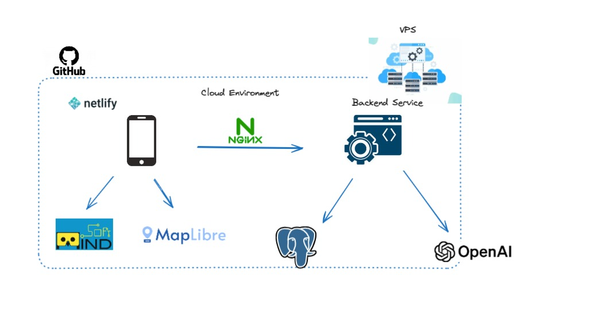

# << PROJECT NAME >>

## Overview
...
...



This repository contains two primary components:

1. Backend: A backend application that uses PostgreSQL as the database and leverages OpenAPI to analyze and generate personality predictions based on user personality Q&A. This backend application also has the capability to store and read objects model for detection.

2. Frontend: A TypeScript-based application built with Vue.js, MapLibre, and MindAR. This frontend application can detect objects and display 3D images accordingly.

We use Git for collaboration on both applications. For the frontend, we utilize Netlify to streamline development and trigger CI/CD deployments whenever code is merged into the `main` branch.

The complete application is also deployed on a VPS for production purposes.

## Getting started on your local machine

### Prerequisites

- Install node version 18
- Install postgres version 15
- Create the database, migrate table, and seed data [database setup instructions](./backend/db/readme.db.md).

### Setup
1. Set the environment
    - Backend

      .env
      ```txt
      PORT=<PORT NUMBER>
      DATABASE_URL=<STRING DATABASE URL>
      OPENAI_API_KEY=<API KEY FOR OPENAI>
      FRONTEND_BASE_URL=<FRONTEND URL>
      ```
    - Frontend

      .env
      ```txt
      VITE_PUBLIC_API_URL=<BACKEND URL>
      ```

2. Build and start the applications
  - Backend: cd ./backend && npm install && npm run dev
  - Frontend: cd ./frontend && npx pnpm install && npx pnpm dev

3. Seed the quest and object model for detection [see setup guideline](./frontend/docs/USAGE.md)

4. For the API docs, you can import the postman collection provided [postman collection](angelhack-grand_final.postman_collection.json)


## Deployment

This application is already deployed to the cloud,
you can find by scan this QR code.

### QR code staging


